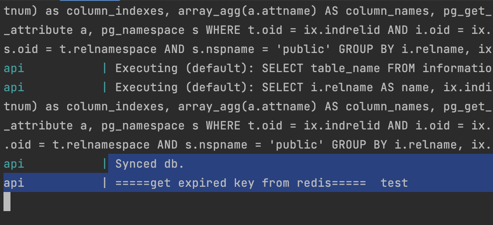

# Introduction
A Example of URL shortening service

## Related Repository
+ [Frontend](https://github.com/Ruila/url-shortener-frontend)
+ [Backend](https://github.com/Ruila/url-shortener-backend)

### Before starting, you should install the following list:

+ [Docker](https://docs.docker.com/desktop/install/mac-install/) (make sure the command `docker-compose` can work)
+ [NodeJS](https://nodejs.org/en/download)

## Installation

#### step 1. Install packages

clone the [backend](https://github.com/Ruila/url-shortener-backend) repository, then install packages through `npm i` or `yarn`.

#### step 2. Start backend server 

run `docker-compose up` to start backend server, then you will see the below information.
It means you wake up server and connect to db successfully.

#### step 3. Start frontend 

clone the [frontend](https://github.com/Ruila/url-shortener-frontend) repository, then install packages through `npm i` or `yarn`.

#### step 4. login to generate your shortenUrl

name: `root`  
password: `root`
